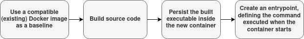

# ilionx assignment for DevOps Engineers

## Prerequisites

### Forking the repository

Create a public GitHub fork of this repository, so employees from ilionx can assess your execution of the assignment. Clone your fork of the repository on your local machine and work in this clone. Don't forget to commit and push your work!

## Starting the environment

The environment uses [Vagrant](https://www.vagrantup.com/) to create a reproducible virtual machine to work on the tasks using VirtualBox. If you don't have Vagrant installed, please do so before running the commands below, following the [instructions on the Vagrant website](https://developer.hashicorp.com/vagrant/downloads?product_intent=vagrant). You will also need [VirtualBox](https://www.virtualbox.org/) to run the actual virtual machine. Follow the [installation instructions](https://www.virtualbox.org/wiki/Downloads) on the VirtualBox website to install the software.

If you prefer, you can also use the package manager of your operating system to install both Vagrant and VirtualBox. Please make sure you have version 2.3.x of Vagrant, and version 7.0.x of VirtualBox for the environment to work.

> Important note for arm64 Mac users: currently, VirtualBox does not work on arm64 Macs. This means you cannot use the pre-configured virtual machine to do the assessment. You can still do the assessment on your Mac, but you will need to install the software needed to do the assessment yourself. You will need [version 17 of Java Temurin](https://adoptium.net/installation/), [Docker](https://docs.docker.com/engine/install/), [Ansible](https://docs.ansible.com/ansible/latest/installation_guide/intro_installation.html), and a scripting language of your choice for the third assignment.

Open a terminal in the directory containing your clone, move to the `vagrant` directory inside it, and start the Vagrant VM:

```shell
$ cd /path/to/devops-interview/vagrant
$ vagrant up
```

This will take some time to download the base box of the VM and provision the image. Depending on the speed of your machine and your internet connection, this will take a few minutes.

After the VM has been started, the command `vagrant ssh` can be used to connect to the VM using secure shell (SSH).

> The VM is set to have a default of 2 vCPUs and 4096 MiB of RAM. These values should be fine for most users, but if you wish they can be changed by setting the `VAGRANT_CPU` and `VAGRANT_MEM` environment variables, i.e. `export VAGRANT_CPU=4` and `export VAGRANT_MEM=8192` before executing `vagrant up`.

If at any point you are experiencing problems with your Vagrant environment, you can always re-create your VM with the following two commands:

```shell
$ vagrant destroy -f
$ vagrant up
```

## Assignments

### Building and containerising a Spring Boot application

In the `helloworld` directory you will find a simple [Spring Boot](https://spring.io/projects/spring-boot) application that spins up a web server that prints `Hello World` when visited. In order to run the code inside a container, the code needs to be built with [Gradle](https://gradle.org/) first. If you are not familiar with Gradle, you can use the Gradle Wrapper with command `./gradlew clean build` to generate an executable `.jar` file that can be used within the container. After building, this file will be located in the `helloworld` directory under `build/libs/helloworld.jar`.

Inside the Vagrant VM, a fully functional build environment is set up for you to get this working. To build the executable jar file, open a shell in your Vagrant VM and do the following:

```shell
$ cd /projects/helloworld
$ ./gradlew clean build
```

After a few seconds, you should get a message `BUILD SUCCESSFUL`. You can now start the executable jar file with the following command:

```shell
$ java -jar build/libs/helloworld.jar
```

Your task is now to create a `Dockerfile` container that we will be using in the next assignment to start this application. See `Dockerfile` for directions. Edit the `Dockerfile` to make it work.

> Optional: We're now assuming that the Spring Boot application is already built before creating the Docker container. For some extra credit, build the Spring Boot application inside Docker too, in order to no longer require a working Java development environment on the build machine.

> Expert option: For experienced users (and even more extra credit), build a pipeline in [GitHub actions](https://github.com/features/actions) that builds the Spring Boot application, and creates a Docker container for it.



### Building and deploying a containerised application with Ansible

The next step is to deploy the containerised application in the Vagrant host on the Docker runtime. The Docker service is not available yet on the Vagrant host, so the first step is to install the Docker service with [Ansible](https://www.ansible.com/). Check this relevant [Docker documentation page](https://docs.docker.com/engine/install/ubuntu/) for directions on how to install Docker on an Ubuntu host and translate these actions into an Ansible playbook. If you are unfamiliar with Ansible playbooks, have a look at the [getting started document on ansible.com](https://docs.ansible.com/ansible/latest/playbook_guide/playbooks_intro.html). After installation, make sure the `systemd` `docker` service is started and will start everytime the Vagrant host is rebooted. Ansible is already pre-installed on the Vagrant machine. Save this playbook under `docker-playbook.yml` in the main directory.

Once the Docker service is started, create a second Ansible playbook to build the `Dockerfile` of the `helloworld.jar` application you have created in the previous step, and to run it on the Vagrant machine. Save this playbook under `helloworld-playbook.yml` in the main directory.

Finally, create one last playbook to modify some operating system settings. Create the following **system-wide** aliases for convenience, **for all users**:

| Alias | Command          |
|-------|------------------|
| `d`   | `docker`         |
| `dc`  | `docker compose` |

Additionally, in the same playbook, create file named `topsecret.txt` in the `/etc` directory containing the message `t0ps3cr3t` in such a way that only the `root` user can read the file.

Save this playbook under `os-playbook.yml` in the main directory.

### Writing a script

The Sunrise Sunset website at [https://sunrise-sunset.org/api](https://sunrise-sunset.org/api) provides a REST API to retrieve sunrise and sunset times for a specific location using coordinates. We would like to have a script that shows when we need to turn the lights in the office on or off. Our office is located in the Netherlands (in the Central European time zone), at the following latitude and longitude:

| Latitude  | Longitude |
|-----------|-----------|
| 50.930581 | 5.780691  |

The office lights should be on between sunset and sunrise, and off between sunrise and sunset. Use information returned from the API call to determine whether the lights should be on or off at the time of script execution. Your script should return nothing more or less than the word `ON` or `OFF`. Make sure to test edge cases, i.e. around the sunrise and sunset times, and around midnight. To accomplish this task, the choice of programming language and/or framework is yours. If you installed additional tools to build and test your script, please show this in your solution too.

> Tip: The Vagrant image contains an installation of [asdf](https://asdf-vm.com/). You are free to use this to install any tools you need to build the script.

## Notes

Please note that this document is merely a guideline for these assignments. If you are comfortable with another language or tool feel free to use this, as long as you reach the same end result. Please show this in your solution if you do.

When you are finished with the assignments, please send the link to your public GitHub repository that contains your solution to your contact at [ilionx](https://www.ilionx.com/).